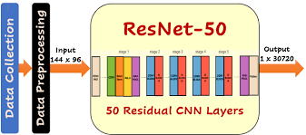
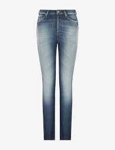
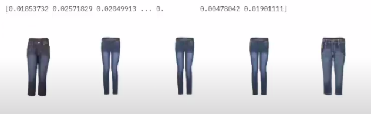
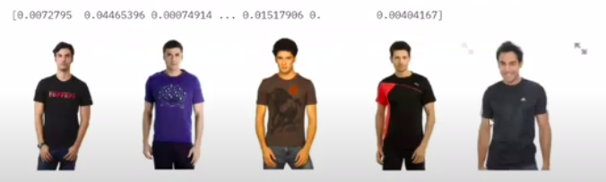

## Content Based Recommendation Engines

The project initially uses the information retrieval paper “A content-based goods image recommendation system” as a baseline model to generate similarity scores for images. The same content-based image retrieval technique is now extended to Deep Learning models and architectures to achieve better results and generate most similar recommendations.

## Approach

   

I have used pretrained model RESNET-50 to fetch similar products for recommedation.
ResNet-50 is a convolutional neural network that is 50 layers deep. One can load a pretrained version of the network trained on more than a million images from the ImageNet database

## Input 1

   

## Output 1

   

## Input 2

   

## Output 2

   

