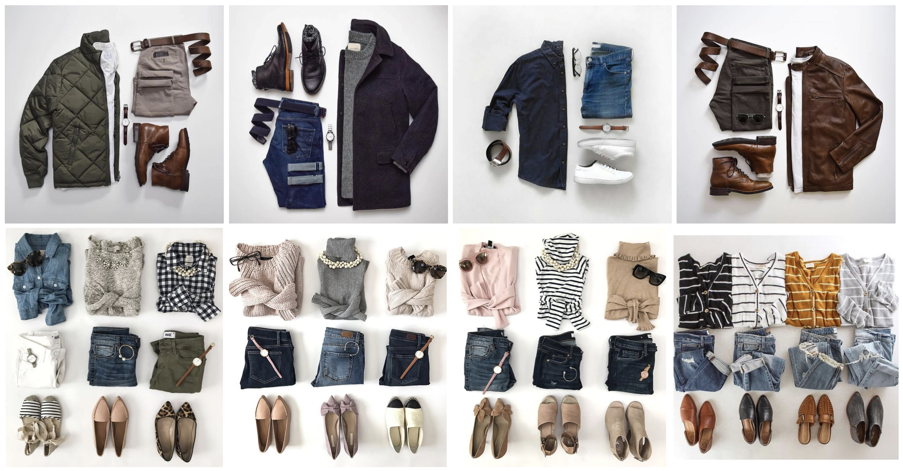

## Fashion Recommendation

## Approach

   

I have used pretrained model RESNET-50 to fetch similar products for recommedation.
ResNet-50 is a convolutional neural network that is 50 layers deep. One can load a pretrained version of the network trained on more than a million images from the ImageNet database

